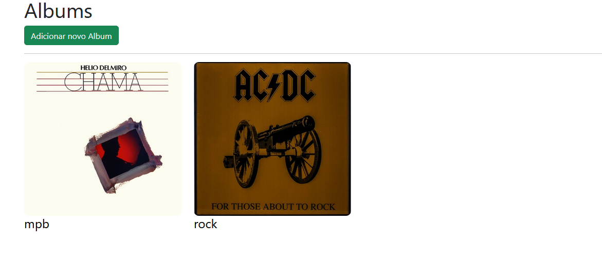
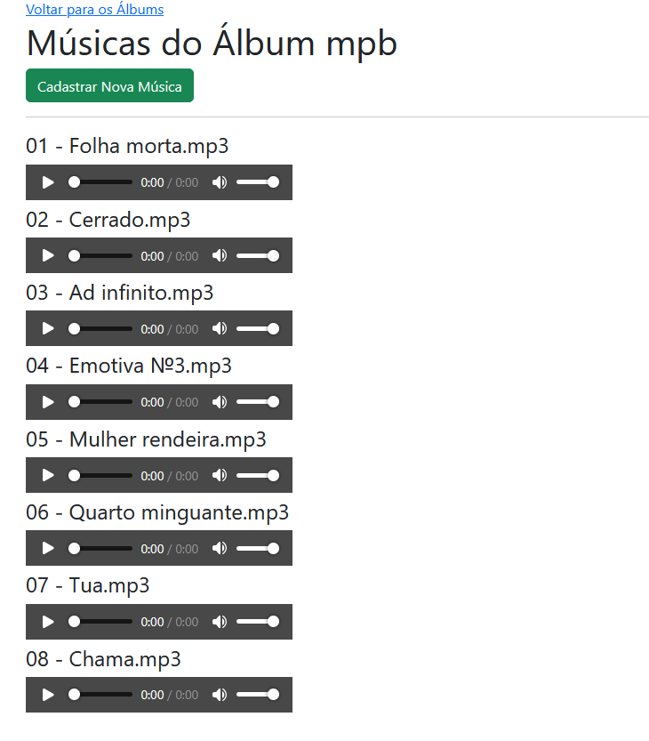
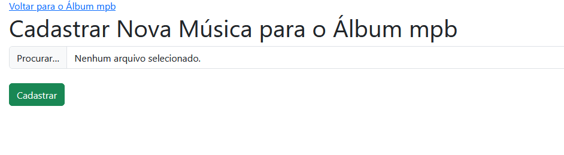

## 📌Sobre o Projeto 
O PHP MP3 é uma aplicação simples para organizar álbuns musicais e reproduzir arquivos MP3 utilizando PHP puro.
 O projeto possui uma interface web que lista álbuns e músicas dinamicamente, permitindo navegar entre os conteúdos de forma prática.

## 🚀Funcionalidades
📁 Listagem de álbuns
 🎶 Exibição das músicas por álbum
 ▶️ Reprodução de arquivos MP3 no navegador
 🖼️ Organização automática dos arquivos
 📱 Interface simples e responsiva
 ⚡ Navegação dinâmica utilizando PHP

## 🛠️Tecnologias Utilizadas
PHP
 HTML5
 CSS3
 Bootstrap

## Imagens do Projeto

